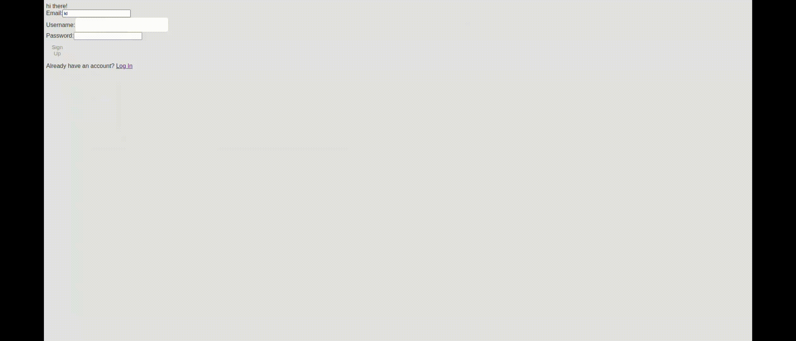

# 📝 ToDo List Application (React + Vite)

A secure and responsive **task management web application** built using **React and Vite**, allowing users to create, track, and manage their daily tasks efficiently.

---

## 🔁 Application Workflow



This GIF shows:
- User authentication
- Creating a new task
- Marking a task as completed
- Deleting tasks
- Real-time UI updates

---

## ✨ Features

- User authentication (secure login system)
- Add new tasks
- Mark tasks as completed
- Delete tasks
- Clean and responsive UI
- Persistent task storage

---

## 🛠 Tech Stack

- **Frontend:** React (Vite)
- **Styling:** CSS
- **Backend / Auth:** *(Supabase / Firebase / Custom API — update this if needed)*
- **Version Control:** Git & GitHub

---

## 🚀 How to Run Locally

```bash
git clone https://github.com/SomdebSar2002/ToDoListProject
cd ToDoListProject
npm install
npm run dev
